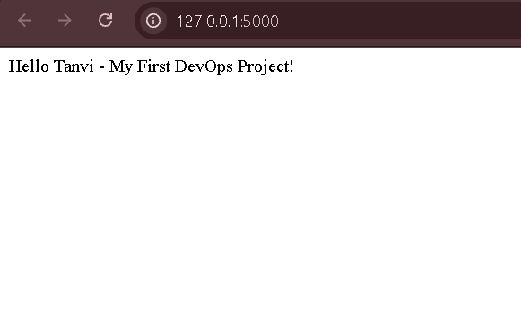

# 🚀 DevOps Docker Flask App

## 📌 Project Overview

This project is a simple Flask web application that is containerized using Docker and automated using a CI/CD pipeline with GitHub Actions. It demonstrates the basic DevOps workflow from development to deployment.

---

## ⚙️ Tech Stack

* Python (Flask)
* Docker
* GitHub Actions (CI/CD)

---

## 📂 Project Structure

```
.
├── .github/workflows/main.yml
├── app.py
├── Dockerfile
├── requirements.txt
├── README.md
├── screenshot.png
```

---

## 🚀 How to Run Locally

### 1. Build Docker Image

```
docker build -t flask-app .
```

### 2. Run Docker Container

```
docker run -p 5000:5000 flask-app
```

### 3. Open in Browser

```
http://localhost:5000
```

---

## 🔄 CI/CD Pipeline

This project uses GitHub Actions to automate the build process.

### Workflow:

* Triggered on every push to `main` branch
* Builds Docker image automatically
* (Optional) Pushes image to Docker Hub

---

## 📸 Screenshot



---

## 🧠 Key Learnings

* Docker image creation and containerization
* CI/CD pipeline setup using GitHub Actions
* Automating build process
* Basic DevOps workflow

---

## 🔗 GitHub Repository

https://github.com/Tanvi-s26/devops-docker-app1

---

## ✨ Author

**Tanvi**
MTech CSE | Aspiring DevOps Engineer
